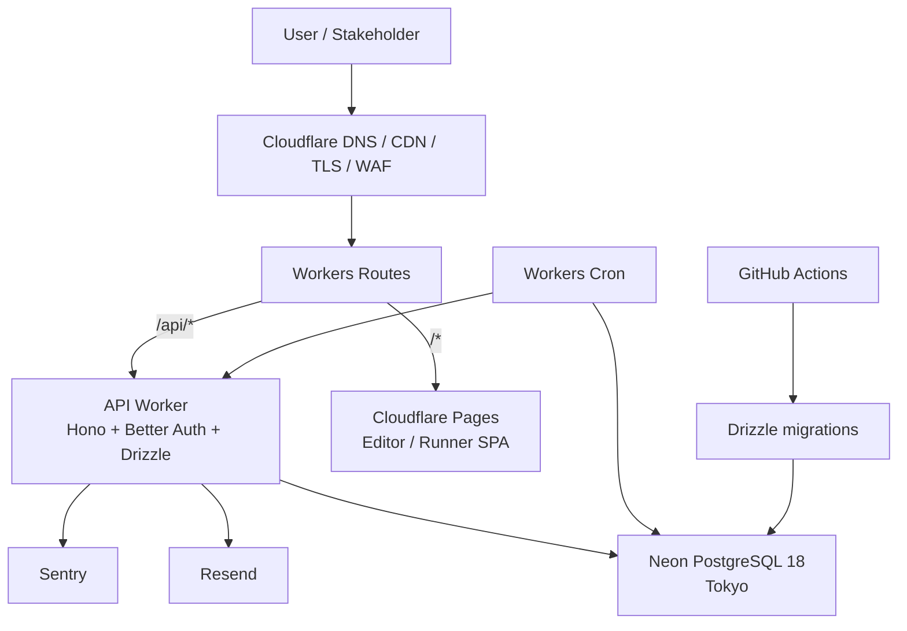

# Cloud Foundation Infrastructure Design

Status: P3.1 deliverable  
Last updated: 2026-05-21

This document is the official P3.1 infrastructure design for LEVERIE Cloud Foundation. It is intentionally self-contained: hosting, runtime, database, auth, email, background jobs, secrets, monitoring, URL policy, cost, CI/CD, and operational rules are all defined here without relying on investigation notes or review logs.

## Goals

The infrastructure should let LEVERIE ship the first cloud foundation with low cost and low operational burden while preserving a credible path to hosted API/MCP, trust operations, and enterprise deployment.

The design optimizes for:

1. Reusing the existing Cloudflare deployment base.
2. Keeping the P3 monthly cost low during validation.
3. Avoiding infrastructure that requires heavy 24/7 maintenance.
4. Supporting Tokyo-region Postgres latency for the initial Japan-centered users.
5. Keeping Phase 4 to Phase 6 expansion possible without a platform rewrite.

## Final Stack

| Layer | Decision |
| --- | --- |
| Frontend hosting | Cloudflare Pages. Editor and Runner share one origin and use route-level code splitting. |
| API runtime | Cloudflare Workers running Hono. |
| Database | Neon PostgreSQL 18.x, Tokyo region (`ap-northeast-1`) as primary target. |
| ORM and migrations | Drizzle ORM and Drizzle Kit. |
| Auth | Better Auth with Drizzle adapter. |
| Email | Resend for magic links and invitations. |
| Background jobs | Cloudflare Workers Cron Triggers. |
| Secrets | Workers Secrets. HMAC key ring stored as JSON secret. |
| Error tracking | Sentry free tier initially. |
| Uptime monitoring | UptimeRobot or BetterStack free tier initially. |
| API migration CI | GitHub Actions: local Postgres validation, Neon preview branch migration for internal PRs, production migration on main/manual run. |
| Primary origin | `leverie.dev` with API under `/api/*`. |

## Non-Goals

P3 does not introduce:

- Kubernetes or long-running container orchestration.
- AWS IAM/VPC/RDS operations.
- A separate hosted Redis service.
- A dedicated queue service unless Workers Cron plus Postgres job tables prove insufficient.
- Cloudflare KV for secrets.
- Enterprise SSO/SAML.
- Multi-region data residency.
- SOC2 automation tooling.

These can be added later when the product phase requires them.

## Architecture



The existing OSS MCP Docker distribution remains independent of this cloud stack and continues to publish through GHCR.

## Runtime Boundaries

| Component | Responsibility | Must not own |
| --- | --- | --- |
| Pages SPA | Editor, Runner, client-side routing, static assets. | Database credentials, auth secrets, direct Postgres access. |
| API Worker | Auth, API routing, repository calls, logic save/evaluate orchestration, audit logging. | Long unbounded jobs, static frontend serving. |
| Cron Worker | Scheduled maintenance and purge dispatch. | User-facing request/response flows. |
| Neon Postgres | Durable state, constraints, migrations, retention queries. | Secret material beyond digests/hashes. |
| Resend | Transactional email delivery. | Identity source of truth. |
| GitHub Actions | Tests, migrations, preview branch lifecycle, deploy orchestration. | Production runtime state. |

## URL and Origin Policy

P3 uses one public origin:

```text
leverie.dev/                          landing
leverie.dev/edit/<workspace>/<logic>  Editor
leverie.dev/run/<org>/<workspace>/<logic>@vN
leverie.dev/api/*                     API Worker
```

The API is path-based (`/api/*`) rather than `api.leverie.dev` for P3.

Reasons:

- Same-origin API calls avoid credentialed CORS in the primary product flow.
- Better Auth can use host-only cookies without a domain cookie.
- Local development can mirror production more closely.
- Runner share URLs stay human-readable and credible for business stakeholders.
- Cloudflare Workers Routes still allow API and frontend to deploy independently.

`api.leverie.dev` remains the fallback if the project later needs stronger API-origin separation, enterprise firewall policies, or region-specific API endpoints.

## Environment Layout

| Environment | Frontend | API | Database | Purpose |
| --- | --- | --- | --- | --- |
| Local | Vite dev server | Wrangler dev | Local Postgres 18 via Docker Compose | Developer iteration. |
| PR preview | Cloudflare Pages preview | Preview Worker or branch deploy | Neon preview branch for internal PRs | Validate migrations and auth/API behavior. |
| Production | Cloudflare Pages production | Production Worker route | Neon production branch | Public product. |

Local development should mirror production routes as closely as possible:

```text
http://localhost:5173/        frontend
http://localhost:5173/api/*   proxied API path when using frontend dev server
http://localhost:8787/api/*   direct Worker dev endpoint
```

Same-origin `/api/*` is the primary path. Cross-origin localhost calls are allowed only through an explicit CORS allowlist.

## Frontend Hosting

Cloudflare Pages remains the frontend hosting layer.

P3 should keep Editor and Runner under a single Pages project unless implementation pressure proves otherwise. The Runner should be introduced as a lazy route so stakeholders do not download the full editor surface unnecessarily.

Expected route split:

| Route | Surface |
| --- | --- |
| `/` | Landing or product entry. |
| `/edit/*` | Authoring editor. |
| `/run/*` | Stakeholder review/run surface. |

If the codebase later splits into `apps/editor` and `apps/runner`, a lightweight Worker route can still keep both surfaces under `leverie.dev`.

Frontend response headers:

| Path | Header policy |
| --- | --- |
| `/edit/*` | Default app CSP, no framing. |
| `/run/*` | Route-specific CSP/frame policy when embed/review sharing requires it. |
| Static assets | Long cache with hashed filenames. |
| HTML entry points | Short cache or no-cache to avoid stale app shells. |

The Runner must not depend on loading the full editor bundle. Shared runtime components should live in packages that can be code-split cleanly.

## API Runtime

Cloudflare Workers is the primary API runtime. Hono gives the project a small framework that can run on Workers and still has a migration path to Node-based hosting if needed.

Workers was selected because:

- It matches the existing Cloudflare footprint.
- Hono is a strong fit for Workers.
- Neon has a Workers-friendly serverless driver.
- Logic evaluation is short-lived and does not need a long-running process.
- Cron Triggers cover P3 background-job needs.
- The spike confirmed Better Auth sign-up, sign-in, and cookie round trip on Workers with `nodejs_compat`.

Fly.io remains the fallback if later implementation hits a hard Workers constraint such as long-running jobs, unsupported runtime APIs, or a dependency that cannot run in Workers.

Worker compatibility requirements:

```toml
compatibility_date = "2024-12-30"
compatibility_flags = ["nodejs_compat"]
```

API route groups:

| Route group | Purpose |
| --- | --- |
| `GET /api/healthz` | Liveness and deployment smoke check. |
| `/api/auth/*` | Better Auth handlers. |
| `/api/orgs/*` | Org lifecycle, membership, invitations. |
| `/api/workspaces/*` | Workspace CRUD and selection. |
| `/api/logics/*` | Draft save, publish, version listing, execution. |
| `/api/api-keys/*` | API key creation, revocation, scoping. |
| `/api/internal/cron/*` | Optional internal endpoints for scheduled jobs if using a shared Worker. |

All mutating routes must write an audit event where security or product analytics require it.

API response conventions:

| Case | Response |
| --- | --- |
| Validation error | `400` with stable code and field errors. |
| Unauthenticated | `401`. |
| Authenticated but unauthorized | `403`. |
| Missing active resource | `404`; do not leak cross-tenant existence. |
| Optimistic lock conflict | `409` with current revision metadata. |
| Rate limited, once implemented | `429`. |
| Unexpected error | `500` with `request_id`; details only in logs/Sentry. |

## Database

Neon PostgreSQL 18.x is the primary production database target.

| Concern | Policy |
| --- | --- |
| Region | Tokyo (`ap-northeast-1`) for the first production project. |
| Environments | Separate dev, preview, and production branches. |
| PR branches | Create preview branches for internal PRs and clean them up on close. |
| Cost guard | Start with low max compute and scale up from metrics. |
| App credentials | Separate migration user and app user; app user has no DDL privileges. |
| Connection | Use `@neondatabase/serverless` from Workers. |
| Backups | Use Neon PITR and git-managed migrations. |

Supabase remains the fallback managed Postgres option. Cloudflare Hyperdrive is not a database provider and is not part of the P3 database choice.

Database extension baseline:

```sql
CREATE EXTENSION IF NOT EXISTS citext;
```

PostgreSQL 18 native `uuidv7()` is used for primary keys. If a local image or provider build does not expose `uuidv7()`, P3.2 must fail fast rather than silently switching ID strategy.

Database roles:

| Role | Permissions |
| --- | --- |
| Migration user | Owns schema objects and can run DDL migrations. Used only in CI/admin migration contexts. |
| App user | DML permissions required by the API. No DDL permissions. |
| Readonly/debug user | Optional. Read-only access for manual inspection. |

Migration policy:

- All schema changes go through Drizzle migrations.
- Migrations are forward-only for normal deployment.
- Destructive migrations require a backup/restore note and explicit rollout plan.
- Production migration runs separately from Worker deploy when possible; API must tolerate old and new schema during rolling deploys when a migration spans code and DB.

## Authentication and Email

P3 uses Better Auth with the Drizzle adapter and Postgres-backed sessions/accounts.

Initial auth methods:

- Email-based auth and invitations through Resend.
- Google OAuth.

Microsoft, SSO, SAML, and enterprise identity integrations are deferred to later phases.

The API implementation must reconcile Better Auth's expected schema with the product schema, especially because LEVERIE does not physically delete `user` rows in P3.

Cookie policy:

| Environment | Policy |
| --- | --- |
| Production | Secure, HttpOnly, SameSite=Lax, host-only cookie on `leverie.dev`. |
| Local HTTP | Development-compatible secure handling as supported by Better Auth/Wrangler. |
| Subdomain fallback | Host-only cookie on `api.leverie.dev`; frontend must use credentialed CORS. |

Email policy:

| Email | Provider | Notes |
| --- | --- | --- |
| Magic/login link | Resend | Time-limited, single-use verification token. |
| Invitation | Resend | Includes org name, inviter where safe, role, expiry. |
| Security notification | Resend later | Add when account/security flows mature. |

Sender domains must be verified before external beta. Development may use Resend sandbox behavior if available, but production must use a verified domain.

## Background Jobs

P3 uses Workers Cron Triggers plus Postgres job/target tables.

Initial jobs:

| Job | Cadence | Purpose |
| --- | --- | --- |
| Org deletion dispatcher | Hourly | Claim orgs ready for purge and advance `org_deletion_job`. |
| Invitation expiry sweep | Daily | Revoke expired unaccepted invitations. |
| Execution log retention | Daily | Remove logs beyond the configured retention window. |
| Audit event retention | Daily | Apply event-class retention policy. |
| API key usage aggregation | Later or periodic | Avoid hot synchronous writes to `last_used_at` if needed. |

Every job must be idempotent, chunked, and safe to retry. Long work should claim batches with `FOR UPDATE SKIP LOCKED` and leave progress in the database.

Cron configuration:

| Job | Suggested schedule |
| --- | --- |
| Org deletion dispatcher | Hourly. |
| Invitation expiry sweep | Daily. |
| Execution log retention | Daily during low-traffic hours. |
| Audit event retention | Daily during low-traffic hours. |

Cron safety rules:

1. A cron invocation must have a maximum batch size.
2. A failed batch must leave enough state for retry.
3. Jobs must record `request_id` or run id in logs.
4. Jobs must not require Cloudflare Queues in P3.
5. If a job approaches Workers CPU/time limits, split the job by smaller claims before introducing a new service.

## Secrets

Workers Secrets is the P3 secret store.

| Secret | Storage |
| --- | --- |
| `DATABASE_URL` | Workers Secret |
| Better Auth secret | Workers Secret |
| Google OAuth client secret | Workers Secret |
| Resend API key | Workers Secret |
| HMAC key ring | Workers Secret containing JSON such as `{ "active": "v2", "keys": { "v1": "...", "v2": "..." } }` |

Workers KV is not needed for P3 secret management. If key enable/disable operations later need product UI, move the key metadata into Postgres while keeping raw key material in a secret or KMS-backed store.

Required secret names:

| Secret | Example binding |
| --- | --- |
| Database URL | `DATABASE_URL` |
| Better Auth secret | `BETTER_AUTH_SECRET` |
| Google OAuth client id | `GOOGLE_CLIENT_ID` |
| Google OAuth client secret | `GOOGLE_CLIENT_SECRET` |
| Resend API key | `RESEND_API_KEY` |
| HMAC key ring | `HMAC_KEY_RING_JSON` |
| Sentry DSN | `SENTRY_DSN` |

HMAC rotation:

1. Add a new key version to `HMAC_KEY_RING_JSON`.
2. Set `"active"` to the new version for newly generated API keys.
3. Keep old versions available for lookup verification.
4. Once no active API keys use an old version, remove that version from the secret.
5. Deploy/refresh the Worker after every secret change.

## CI and Deployment

| Target | Pipeline |
| --- | --- |
| Editor / Runner | Cloudflare Pages GitHub integration. |
| API Worker | GitHub Actions and `wrangler deploy`. |
| Migrations | GitHub Actions and Drizzle Kit. |
| MCP Docker | Existing GHCR workflow, independent of Cloud Foundation. |

Migration CI rules:

1. Pull requests validate migrations against local Postgres 18.
2. Internal PRs create and migrate a Neon preview branch named from the PR number.
3. Closing a PR cleans up its preview branch.
4. Main pushes or manual production runs migrate the production Neon database.

Required GitHub Actions inputs/secrets:

| Name | Scope |
| --- | --- |
| `CLOUDFLARE_API_TOKEN` | Deploy Workers/Pages as needed. |
| `CLOUDFLARE_ACCOUNT_ID` | Cloudflare account. |
| `NEON_API_KEY` | Preview branch create/delete. |
| `NEON_PROJECT_ID` | Target Neon project. |
| `DATABASE_URL` or branch-specific URL output | Migration target. |
| `PRODUCTION_DATABASE_URL` | Production migration target; protected environment. |

PR migration flow:

1. Start local Postgres 18.
2. Run Drizzle migrations against local Postgres.
3. Run migration/schema tests.
4. If PR is internal and secrets are available, create or reuse Neon preview branch `gh-pr-<number>`.
5. Run migrations against the Neon preview branch.
6. On PR close, delete the Neon preview branch.

Production flow:

1. Require protected environment approval if configured.
2. Run Drizzle migrations against production.
3. Deploy Worker.
4. Run health and auth/database smoke checks.

## Observability

P3 starts with the lowest operational surface that still exposes failures quickly.

| Need | Tool |
| --- | --- |
| Application errors | Sentry |
| Worker metrics | Cloudflare Workers Analytics |
| Request logs | Workers Logs; Logpush later if needed |
| Database metrics | Neon Console |
| Uptime | UptimeRobot or BetterStack |
| Product KPI | Queries over `audit_event`, exported manually during P3 |

F-4 KPI reporting can begin as manual export. Automation belongs in a later phase once the metric definitions stabilize.

Logging requirements:

- Every request gets a `request_id`.
- Unexpected errors include `request_id`, route, status, and sanitized actor context.
- Do not log raw API keys, auth tokens, magic links, invitation tokens, or sensitive Logic inputs.
- Execution logs may store inputs only according to workspace/data policy; P3 defaults should be conservative.
- Sentry events must scrub cookies and authorization headers.

Minimum dashboards/manual checks:

| Check | Source |
| --- | --- |
| API request volume and errors | Cloudflare Workers Analytics. |
| Database compute/storage | Neon Console. |
| Auth failures/spikes | API logs and audit events. |
| Invitation delivery failures | Resend dashboard. |
| Purge failures | `org_deletion_job` plus Sentry/logs. |

## Cost Plan

| Stage | Expected monthly cost |
| --- | --- |
| Internal validation and early external demos | About USD 10-25 |
| Public beta after F-4 traction | About USD 40-60 |
| Hosted API/MCP growth | About USD 80-150 |
| Enterprise pilot with trust tooling | About USD 300-500 |

The P3 lean baseline is Workers Paid, low-CU Neon usage, Resend Free, and free-tier monitoring. Resend Pro and higher Neon compute should wait until actual email volume or API traffic justifies them.

Cost guardrails:

| Service | Guardrail |
| --- | --- |
| Neon | Low max CU at launch; preview branches expire/are deleted; monitor storage growth. |
| Workers | Start with Workers Paid; watch CPU time and request volume. |
| Resend | Stay on free tier until daily invite/login volume requires Pro. |
| Sentry | Scrub noisy errors; avoid exceeding free tier through repeated known failures. |
| Logs | Do not enable paid Logpush destinations until operationally needed. |

## Growth Path

| Phase | Addition |
| --- | --- |
| P4 Hosted API/MCP | Durable Objects for rate limiting or MCP session state; KV for cacheable schemas if useful. |
| P5 Trust and Ops | Logpush to R2 or Datadog, webhook delivery infrastructure, operational dashboards. |
| P6 Enterprise | Regional Neon projects, WorkOS/Auth0-style SSO, SOC2 tooling, stronger audit/export controls. |

The key principle is to keep the root platform Cloudflare plus Neon while adding specialized services only when the product phase creates a real need.

Fallback criteria:

| Component | Fallback | Trigger |
| --- | --- | --- |
| Workers API | Fly.io or another Docker host | Runtime incompatibility, long-running request needs, or dependency that cannot run on Workers. |
| Neon | Supabase Postgres | Neon regional/PG18 availability, cost, or operational limitation. |
| Resend | Postmark/SendGrid | Deliverability or regional compliance requirement. |
| Workers Cron | Cloudflare Queues/Workflows or Inngest | Job orchestration becomes multi-step, long-running, or externally retry-heavy. |
| Path-based API | `api.leverie.dev` | Enterprise/security need for API origin separation. |

## P3.2 Implementation Requirements

P3.2 should implement:

- `apps/api` with Hono on Workers.
- Drizzle schema and migrations for the P3.1 database design.
- Local `docker-compose` for Postgres 18.
- Better Auth schema reconciliation.
- Path-based `/api/*` routing.
- CORS allowlist only for non-same-origin development or fallback deployments.
- Migration validation in GitHub Actions.
- Neon preview branch migration and cleanup.
- Minimal health, auth, and database smoke checks.

## Acceptance Criteria

P3.2 infrastructure is complete when:

1. Local API boots with Hono, Better Auth, Drizzle, and Postgres 18.
2. `GET /api/healthz` proves Worker/runtime health.
3. Auth sign-up/sign-in or equivalent Better Auth smoke flow works locally.
4. Database migrations run from a clean database.
5. GitHub Actions validates migrations against local Postgres 18.
6. Internal PRs can migrate a Neon preview branch and clean it up on close.
7. Production migration path is defined through a protected workflow.
8. `/api/*` path-based routing is the documented production route.
9. CORS is disabled for same-origin production and allowlisted only where needed.
10. Required secrets are documented in deployment configuration.
