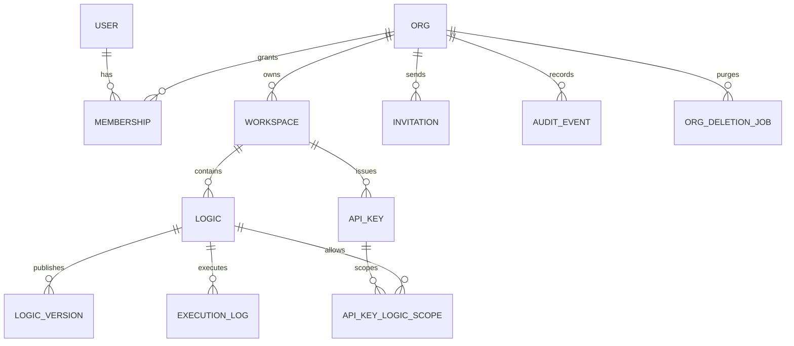

# Cloud Foundation Schema Design

Status: P3.1 deliverable  
Last updated: 2026-05-21

This document is the official P3.1 schema design for LEVERIE Cloud Foundation. It is intentionally self-contained: API, migration, auth, and operations implementation should be possible from this document without consulting investigation notes or review logs.

## Goals

P3.1 defines the Cloud Foundation data model before API and migration work begins. The design prioritizes tenant isolation, operational recoverability, and a schema that is strict enough to prevent dangerous cloud-era bugs at the database boundary.

The schema must:

1. Model the initial cloud entities: `user`, `org`, `workspace`, `membership`, `invitation`, `logic`, `logic_version`, `api_key`, `api_key_logic_scope`, `execution_log`, `audit_event`, and `org_deletion_job`.
2. Enforce tenant boundaries with composite foreign keys, partial unique indexes, and CHECK constraints.
3. Keep Logic JSON as the product source format while validating it before save.
4. Preserve auditability through soft deletion, immutable publish history, execution logs, and explicit purge jobs.
5. Support Better Auth, API key authentication, and future hosted API/MCP expansion without forcing a schema rewrite.

## Final Decisions

| Area | Decision |
| --- | --- |
| Multi-tenancy | Pool model: one Postgres database with tenant-scoped columns and composite constraints. |
| Production database | Managed PostgreSQL 18.x. Neon is the primary provider, Supabase is the fallback. |
| Local and CI database | `postgres:18-alpine`. |
| ID strategy | UUID v7 with database defaults (`uuidv7()`). |
| Role representation | `TEXT` plus CHECK constraints. Initial roles are `owner`, `admin`, `editor`, `viewer`, and `runner`. |
| Logic storage | Store Logic JSON v2 in `jsonb`. Do not normalize rule/table internals in P3. |
| Logic validation | Run `LogicSchema.parse(data)` followed by `validateLogicForSave(data)` on every save path. |
| Canonical metadata | `logic.name`, `logic.description`, and related metadata columns are canonical. JSON metadata is synchronized, not authoritative. |
| Draft concurrency | `logic.draft_revision` with `If-Match` style optimistic locking. |
| Publish model | `logic_version` is immutable. Production points at a validated version through composite constraints. |
| User deletion | Users are redacted and soft-deleted. User rows are not physically deleted in P3, including org purge. |
| Org deletion | `org.deleted_at`, `lifecycle_status`, and `purge_requested_at` move through explicit lifecycle states. |
| Org purge | `org_deletion_job` is the canonical purge mechanism. Cascades are only a safety net. |
| API key lookup | Two-stage lookup using `lookup_secret_version`, `lookup_digest`, and `key_hash`. |
| Audit retention | `audit_event.event_class` separates security, product, and system retention needs. |
| Execution retention | `execution_log` is append-only until retention sweep. Errors keep `error_code` and `request_id`; `inputs` can be nullable. |

## Naming and Global Conventions

All table names are singular snake_case. All timestamps are `TIMESTAMPTZ` and stored in UTC.

Mutable tables have:

```sql
created_at TIMESTAMPTZ NOT NULL DEFAULT now(),
updated_at TIMESTAMPTZ NOT NULL DEFAULT now()
```

`updated_at` is maintained by a shared trigger:

```sql
CREATE OR REPLACE FUNCTION set_updated_at()
RETURNS trigger AS $$
BEGIN
  NEW.updated_at = now();
  RETURN NEW;
END;
$$ LANGUAGE plpgsql;
```

Every mutable table has a `BEFORE UPDATE` trigger using this function.

Use `TEXT` plus CHECK constraints instead of PostgreSQL enums. This keeps later role/state additions migration-friendly.

Slug columns are lower-case, URL-safe identifiers:

```sql
CHECK (slug ~ '^[a-z0-9][a-z0-9-]{1,62}[a-z0-9]$')
```

Reserve product/system slugs such as `api`, `app`, `admin`, `auth`, `run`, `edit`, `www`, `support`, `help`, `settings`, and `billing`.

## Entity Model



`user` is global. Most other product data is owned by an org, directly or through workspace and logic. Tenant-scoped children must carry the relevant tenant columns needed to validate the relationship with composite foreign keys.

## Table Specifications

The following columns define the P3.1 implementation contract. Implementations may add generated indexes or adapter-required auth columns, but must not weaken the constraints or lifecycle rules defined here.

### `user`

Global human identity. A user can belong to multiple orgs.

| Column | Type | Notes |
| --- | --- | --- |
| `id` | `UUID PRIMARY KEY DEFAULT uuidv7()` | Global user id. |
| `email` | `CITEXT NOT NULL UNIQUE` | Canonical login email. Redacted on account deletion. |
| `email_verified_at` | `TIMESTAMPTZ` | Set by auth flow. |
| `name` | `TEXT NOT NULL` | Display name. Redacted on deletion. |
| `image_url` | `TEXT` | OAuth/avatar source. |
| `last_login_at` | `TIMESTAMPTZ` | Updated on successful login. |
| `deleted_at` | `TIMESTAMPTZ` | Redacted/disabled user marker. |
| `created_at` / `updated_at` | `TIMESTAMPTZ` | Standard timestamps. |

P3 never physically deletes users. Account deletion is a transaction that rewrites `email` to an irreversible tombstone, clears optional PII, sets `name` to a neutral deleted label, and sets `deleted_at`.

### `org`

Top-level tenant and billing/security boundary.

| Column | Type | Notes |
| --- | --- | --- |
| `id` | `UUID PRIMARY KEY DEFAULT uuidv7()` | Tenant id. |
| `slug` | `TEXT NOT NULL` | Human-readable URL segment. |
| `name` | `TEXT NOT NULL` | Display name. |
| `plan` | `TEXT NOT NULL DEFAULT 'free'` | `free`, `pro`, `team`, `enterprise`. Billing state only. |
| `lifecycle_status` | `TEXT NOT NULL DEFAULT 'active'` | `active`, `deleting`, `purging`. Operational state only. |
| `deleted_at` | `TIMESTAMPTZ` | Soft-delete timestamp. |
| `purge_requested_at` | `TIMESTAMPTZ` | Time at which purge becomes scheduled. |
| `created_actor_type` / `created_actor_id` | `TEXT` / `UUID` | `user` requires id; `system` requires NULL id. |
| `updated_actor_type` / `updated_actor_id` | `TEXT` / `UUID` | Nullable actor pair. |
| `created_at` / `updated_at` | `TIMESTAMPTZ` | Standard timestamps. |

Constraints:

```sql
CHECK (plan IN ('free', 'pro', 'team', 'enterprise'));
CHECK (lifecycle_status IN ('active', 'deleting', 'purging'));
CHECK (
  (lifecycle_status = 'active' AND deleted_at IS NULL AND purge_requested_at IS NULL)
  OR
  (lifecycle_status IN ('deleting', 'purging') AND deleted_at IS NOT NULL AND purge_requested_at IS NOT NULL)
);
CREATE UNIQUE INDEX org_slug_not_purged_uniq
  ON org (slug)
  WHERE lifecycle_status IN ('active', 'deleting', 'purging');
```

The slug remains reserved during the recovery and purge period.

### `workspace`

Logical area inside an org.

| Column | Type | Notes |
| --- | --- | --- |
| `id` | `UUID PRIMARY KEY DEFAULT uuidv7()` | Workspace id. |
| `org_id` | `UUID NOT NULL REFERENCES org(id)` | Parent tenant. |
| `slug` | `TEXT NOT NULL` | Unique among non-deleted workspaces in the org. |
| `name` | `TEXT NOT NULL` | Display name. |
| `description` | `TEXT` | Optional. |
| `deleted_at` | `TIMESTAMPTZ` | Soft delete. |
| `created_actor_type` / `created_actor_id` | `TEXT` / `UUID` | `user` or `system`. |
| `updated_actor_type` / `updated_actor_id` | `TEXT` / `UUID` | Nullable actor pair. |
| `created_at` / `updated_at` | `TIMESTAMPTZ` | Standard timestamps. |

Indexes and constraints:

```sql
UNIQUE (org_id, id);
CREATE UNIQUE INDEX workspace_org_slug_active_uniq
  ON workspace (org_id, slug)
  WHERE deleted_at IS NULL;
```

### `membership`

Active or removed org membership. There is no status column; lifecycle is represented by `removed_at`.

| Column | Type | Notes |
| --- | --- | --- |
| `id` | `UUID PRIMARY KEY DEFAULT uuidv7()` | Membership id. |
| `org_id` | `UUID NOT NULL` | Tenant. |
| `user_id` | `UUID NOT NULL` | User. |
| `role` | `TEXT NOT NULL` | `owner`, `admin`, `editor`, `viewer`, `runner`. |
| `invited_actor_type` / `invited_actor_id` | `TEXT` / `UUID` | `user` or `system`. |
| `invited_at` | `TIMESTAMPTZ NOT NULL DEFAULT now()` | Invitation or bootstrap time. |
| `joined_at` | `TIMESTAMPTZ NOT NULL DEFAULT now()` | Effective membership time. |
| `removed_at` | `TIMESTAMPTZ` | Removal time. |
| `created_at` / `updated_at` | `TIMESTAMPTZ` | Standard timestamps. |

Constraints:

```sql
FOREIGN KEY (org_id) REFERENCES org(id) ON DELETE CASCADE;
FOREIGN KEY (user_id) REFERENCES "user"(id)
  ON DELETE NO ACTION DEFERRABLE INITIALLY IMMEDIATE;
CHECK (role IN ('owner', 'admin', 'editor', 'viewer', 'runner'));
CREATE UNIQUE INDEX membership_active_user_org_uniq
  ON membership (org_id, user_id)
  WHERE removed_at IS NULL;
```

Removing the last active owner is forbidden in application code by locking the org row and counting active owners in the same transaction.

### `invitation`

Pending, accepted, expired, or revoked invitation to an org.

| Column | Type | Notes |
| --- | --- | --- |
| `id` | `UUID PRIMARY KEY DEFAULT uuidv7()` | Invitation id. |
| `org_id` | `UUID NOT NULL` | Tenant. |
| `email` | `CITEXT NOT NULL` | Invitee email. |
| `role` | `TEXT NOT NULL` | Role to grant. |
| `token_digest` | `TEXT NOT NULL UNIQUE` | Digest of invite token. |
| `expires_at` | `TIMESTAMPTZ NOT NULL` | Expiry time. |
| `accepted_at` | `TIMESTAMPTZ` | Terminal accepted state. |
| `accepted_actor_type` / `accepted_actor_id` | `TEXT` / `UUID` | `user` or `system`; nullable pair. |
| `revoked_at` | `TIMESTAMPTZ` | Terminal revoked state. |
| `invited_actor_type` / `invited_actor_id` | `TEXT` / `UUID` | `user` or `system`. |
| `created_at` / `updated_at` | `TIMESTAMPTZ` | Standard timestamps. |

Constraints:

```sql
CHECK (role IN ('owner', 'admin', 'editor', 'viewer', 'runner'));
CHECK (NOT (accepted_at IS NOT NULL AND revoked_at IS NOT NULL));
CHECK (accepted_at IS NULL OR accepted_at <= expires_at);
CREATE UNIQUE INDEX invitation_pending_email_org_uniq
  ON invitation (org_id, email)
  WHERE accepted_at IS NULL AND revoked_at IS NULL;
```

Re-inviting the same email should synchronously revoke any still-pending invitation before inserting the new one.

### `logic`

Editable decision logic draft and publish pointer.

| Column | Type | Notes |
| --- | --- | --- |
| `id` | `UUID PRIMARY KEY DEFAULT uuidv7()` | Logic id. |
| `workspace_id` | `UUID NOT NULL` | Tenant scope. |
| `slug` | `TEXT NOT NULL` | Unique among active logic in workspace. |
| `name` | `TEXT NOT NULL` | Canonical name. |
| `description` | `TEXT` | Canonical description. |
| `schema_version` | `TEXT NOT NULL` | Must match `draft_data->>'version'`. |
| `draft_data` | `JSONB NOT NULL` | Current editable Logic JSON. |
| `draft_revision` | `INTEGER NOT NULL DEFAULT 1` | Optimistic lock token. |
| `draft_updated_at` | `TIMESTAMPTZ NOT NULL DEFAULT now()` | Body edit time only. |
| `draft_updated_actor_type` / `draft_updated_actor_id` | `TEXT` / `UUID` | `user` or `system`. |
| `production_version_id` | `UUID` | Current production version. |
| `deleted_at` | `TIMESTAMPTZ` | Soft delete. |
| `created_actor_type` / `created_actor_id` | `TEXT` / `UUID` | `user` or `system`. |
| `updated_actor_type` / `updated_actor_id` | `TEXT` / `UUID` | `user`, `api_key`, or `system`; nullable pair. |
| `created_at` / `updated_at` | `TIMESTAMPTZ` | Standard timestamps. |

Constraints:

```sql
UNIQUE (workspace_id, id);
CHECK (jsonb_typeof(draft_data->'version') = 'string');
CHECK (schema_version = draft_data->>'version');
CREATE UNIQUE INDEX logic_workspace_slug_active_uniq
  ON logic (workspace_id, slug)
  WHERE deleted_at IS NULL;
FOREIGN KEY (workspace_id, production_version_id)
  REFERENCES logic_version (workspace_id, id)
  ON DELETE NO ACTION DEFERRABLE INITIALLY IMMEDIATE;
```

The production pointer must only point to a version belonging to this logic. In Drizzle/DDL, enforce this with an additional composite unique key on `logic_version` and a composite FK that includes `logic_id` when practical.

### `logic_version`

Immutable published snapshot.

| Column | Type | Notes |
| --- | --- | --- |
| `id` | `UUID PRIMARY KEY DEFAULT uuidv7()` | Version id. |
| `workspace_id` | `UUID NOT NULL` | Tenant scope. |
| `logic_id` | `UUID NOT NULL` | Parent logic. |
| `version_number` | `INTEGER NOT NULL` | Monotonic per logic. |
| `schema_version` | `TEXT NOT NULL` | Must match `data->>'version'`. |
| `data` | `JSONB NOT NULL` | Published Logic JSON. |
| `release_notes` | `TEXT` | Plain text for P3. |
| `published_actor_type` / `published_actor_id` | `TEXT` / `UUID` | `user` or `system`. |
| `published_at` | `TIMESTAMPTZ NOT NULL DEFAULT now()` | Immutable publish time. |

Constraints:

```sql
FOREIGN KEY (workspace_id, logic_id)
  REFERENCES logic (workspace_id, id) ON DELETE CASCADE;
UNIQUE (logic_id, version_number);
UNIQUE (logic_id, id);
UNIQUE (logic_id, id, version_number);
CHECK (version_number > 0);
CHECK (jsonb_typeof(data->'version') = 'string');
CHECK (schema_version = data->>'version');
```

### `api_key`

Workspace-scoped credential for hosted API/MCP access.

| Column | Type | Notes |
| --- | --- | --- |
| `id` | `UUID PRIMARY KEY DEFAULT uuidv7()` | Key id. |
| `workspace_id` | `UUID NOT NULL` | Scope. |
| `name` | `TEXT NOT NULL` | Display name. |
| `prefix` | `TEXT NOT NULL` | Public key prefix shown to users. |
| `lookup_secret_version` | `TEXT NOT NULL DEFAULT 'v1'` | HMAC key-ring version. |
| `lookup_digest` | `TEXT NOT NULL` | HMAC digest used for lookup. |
| `key_hash` | `TEXT NOT NULL` | Argon2 or equivalent verifier. |
| `expires_at` | `TIMESTAMPTZ` | Optional expiry. |
| `revoked_at` | `TIMESTAMPTZ` | Revocation. |
| `last_used_at` | `TIMESTAMPTZ` | Best-effort usage marker. |
| `created_actor_type` / `created_actor_id` | `TEXT` / `UUID` | `user` or `system`. |
| `created_at` / `updated_at` | `TIMESTAMPTZ` | Standard timestamps. |

Constraints:

```sql
UNIQUE (workspace_id, id);
UNIQUE (lookup_secret_version, lookup_digest);
```

Authentication first computes `lookup_digest` using the active/known HMAC secret version, finds the row, then verifies the full presented key against `key_hash`.

### `api_key_logic_scope`

Join table limiting an API key to specific logic records. Absence of rows can mean workspace-wide access only if the API permission model explicitly allows it; otherwise require at least one row for scoped keys.

| Column | Type | Notes |
| --- | --- | --- |
| `api_key_id` | `UUID NOT NULL` | API key. |
| `workspace_id` | `UUID NOT NULL` | Tenant prefix for integrity and indexing. |
| `logic_id` | `UUID NOT NULL` | Allowed logic. |
| `created_at` | `TIMESTAMPTZ NOT NULL DEFAULT now()` | Creation time. |

Constraints:

```sql
PRIMARY KEY (api_key_id, logic_id);
FOREIGN KEY (workspace_id, api_key_id)
  REFERENCES api_key (workspace_id, id) ON DELETE CASCADE;
FOREIGN KEY (workspace_id, logic_id)
  REFERENCES logic (workspace_id, id) ON DELETE CASCADE;
```

### `execution_log`

Append-only record of logic execution.

| Column | Type | Notes |
| --- | --- | --- |
| `id` | `UUID PRIMARY KEY DEFAULT uuidv7()` | Log id. |
| `workspace_id` | `UUID NOT NULL` | Tenant scope. |
| `logic_id` | `UUID NOT NULL` | Executed logic. |
| `logic_version_id` | `UUID NOT NULL` | Resolved version id. |
| `requested_version_type` | `TEXT NOT NULL` | `production`, `version`, or `draft` if allowed internally. |
| `requested_version_number` | `INTEGER` | Required only when type is `version`. |
| `resolved_version_number` | `INTEGER NOT NULL` | Version actually executed. |
| `caller_actor_type` | `TEXT NOT NULL` | `user`, `api_key`, `system`. |
| `caller_actor_id` | `UUID` | Required for user/api_key; NULL for system. |
| `caller_channel` | `TEXT NOT NULL` | `web`, `api_key`, `mcp`, `system`. |
| `caller_user_id` | `UUID` | FK when caller is user. |
| `caller_api_key_id` | `UUID` | FK when caller is API key. |
| `actor_persona` | `TEXT NOT NULL DEFAULT 'unknown'` | KPI grouping; API key/system remain unknown. |
| `inputs` | `JSONB` | Nullable for failures or redaction. |
| `outputs` | `JSONB` | Nullable on error. |
| `matched_rule_ids` | `JSONB` | Optional trace summary. |
| `duration_ms` | `INTEGER` | Non-negative when present. |
| `status` | `TEXT NOT NULL` | `success`, `no_match`, `error`. |
| `error_code` | `TEXT` | Required for error. |
| `request_id` | `TEXT NOT NULL` | Correlation id. |
| `created_at` | `TIMESTAMPTZ NOT NULL DEFAULT now()` | Execution time. |

Constraints:

```sql
FOREIGN KEY (workspace_id, logic_id)
  REFERENCES logic (workspace_id, id)
  ON DELETE NO ACTION DEFERRABLE INITIALLY IMMEDIATE;
FOREIGN KEY (logic_id, logic_version_id, resolved_version_number)
  REFERENCES logic_version (logic_id, id, version_number)
  ON DELETE NO ACTION DEFERRABLE INITIALLY IMMEDIATE;
FOREIGN KEY (workspace_id, caller_api_key_id)
  REFERENCES api_key (workspace_id, id)
  ON DELETE NO ACTION DEFERRABLE INITIALLY IMMEDIATE;
FOREIGN KEY (caller_user_id)
  REFERENCES "user"(id)
  ON DELETE NO ACTION DEFERRABLE INITIALLY IMMEDIATE;
CHECK (requested_version_type IN ('production', 'version', 'draft'));
CHECK ((requested_version_type = 'version') = (requested_version_number IS NOT NULL));
CHECK (caller_actor_type IN ('user', 'api_key', 'system'));
CHECK (caller_channel IN ('web', 'api_key', 'mcp', 'system'));
CHECK (status IN ('success', 'no_match', 'error'));
CHECK ((status = 'error') = (error_code IS NOT NULL));
```

For P3, MCP calls must use `caller_actor_type = 'api_key'` and `caller_channel = 'mcp'`.

### `audit_event`

Append-only security/product/system audit stream.

| Column | Type | Notes |
| --- | --- | --- |
| `id` | `UUID PRIMARY KEY DEFAULT uuidv7()` | Event id. |
| `org_id` | `UUID NOT NULL` | Tenant. |
| `workspace_id` | `UUID` | Optional workspace scope. |
| `event_class` | `TEXT NOT NULL` | `security`, `product`, `system`. |
| `event_type` | `TEXT NOT NULL` | Stable event name. |
| `actor_type` | `TEXT NOT NULL` | `user`, `api_key`, `system`. |
| `actor_id` | `UUID` | Required for user/api_key; NULL for system. |
| `actor_user_id` | `UUID` | FK when actor is user. |
| `actor_api_key_id` | `UUID` | FK when actor is API key. |
| `actor_channel` | `TEXT NOT NULL` | `web`, `api_key`, `mcp`, `system`. |
| `actor_persona` | `TEXT NOT NULL DEFAULT 'unknown'` | KPI grouping. |
| `target_type` | `TEXT` | Domain object type. |
| `target_id` | `UUID` | Domain object id. |
| `metadata` | `JSONB NOT NULL DEFAULT '{}'::jsonb` | Event-specific payload. |
| `request_id` | `TEXT` | Correlation id. |
| `created_at` | `TIMESTAMPTZ NOT NULL DEFAULT now()` | Event time. |

Constraints:

```sql
CHECK (event_class IN ('security', 'product', 'system'));
CHECK (actor_type IN ('user', 'api_key', 'system'));
CHECK (actor_channel IN ('web', 'api_key', 'mcp', 'system'));
FOREIGN KEY (org_id) REFERENCES org(id) ON DELETE CASCADE;
FOREIGN KEY (org_id, workspace_id)
  REFERENCES workspace (org_id, id)
  ON DELETE CASCADE;
FOREIGN KEY (actor_user_id)
  REFERENCES "user"(id)
  ON DELETE NO ACTION DEFERRABLE INITIALLY IMMEDIATE;
FOREIGN KEY (workspace_id, actor_api_key_id)
  REFERENCES api_key (workspace_id, id)
  ON DELETE NO ACTION DEFERRABLE INITIALLY IMMEDIATE;
```

### `org_deletion_job`

Operational history for org purge. It intentionally survives org deletion by not relying on an FK to `org`.

| Column | Type | Notes |
| --- | --- | --- |
| `id` | `UUID PRIMARY KEY DEFAULT uuidv7()` | Job id. |
| `org_id` | `UUID NOT NULL` | Deleted org id, no FK. |
| `status` | `TEXT NOT NULL` | `pending`, `running`, `completed`, `failed`. |
| `progress` | `JSONB NOT NULL DEFAULT '{}'::jsonb` | Counts and last step. |
| `attempt_count` | `INTEGER NOT NULL DEFAULT 0` | Retry count. |
| `last_error` | `TEXT` | Present only for failed. |
| `started_at` | `TIMESTAMPTZ` | Present for running/completed/failed after first attempt. |
| `completed_at` | `TIMESTAMPTZ` | Present only for completed. |
| `created_at` / `updated_at` | `TIMESTAMPTZ` | Standard timestamps. |

Constraints:

```sql
CHECK (status IN ('pending', 'running', 'completed', 'failed'));
CHECK (attempt_count >= 0);
CHECK (
  (status = 'pending' AND started_at IS NULL AND completed_at IS NULL AND last_error IS NULL)
  OR
  (status = 'running' AND started_at IS NOT NULL AND completed_at IS NULL AND last_error IS NULL)
  OR
  (status = 'completed' AND started_at IS NOT NULL AND completed_at IS NOT NULL AND last_error IS NULL)
  OR
  (status = 'failed' AND started_at IS NOT NULL AND completed_at IS NULL AND last_error IS NOT NULL)
);
```

Retries reuse the same row: set `status = 'running'`, increment `attempt_count`, clear `last_error`, and continue from `progress`.

## Tenant Boundary Rules

The schema does not rely on application filtering alone. Tenant isolation is enforced in three layers:

| Layer | Rule |
| --- | --- |
| Database | Add composite unique keys such as `(org_id, id)`, `(workspace_id, id)`, `(logic_id, id)`, and `(logic_id, id, version_number)`; child tables reference those composites. |
| Repository | Route handlers use tenant-scoped repositories instead of raw database access. |
| CI | Architecture tests should reject direct route-handler imports of the raw database client. |

This means a row cannot point at a logic, version, workspace, or API key from a different tenant even if a route handler has a bug.

## Indexing Requirements

Minimum indexes:

| Table | Index |
| --- | --- |
| `org` | unique active/deleting/purging slug; lifecycle lookup by `(lifecycle_status, purge_requested_at)`. |
| `workspace` | active slug per org; `(org_id, deleted_at)`. |
| `membership` | active unique `(org_id, user_id)`; active owner lookup `(org_id, role)` where `removed_at IS NULL`. |
| `invitation` | pending unique `(org_id, email)`; expiry sweep by `(expires_at)` where pending. |
| `logic` | active slug per workspace; `(workspace_id, deleted_at)`. |
| `logic_version` | `(logic_id, version_number)` and `(logic_id, id, version_number)`. |
| `api_key` | unique `(lookup_secret_version, lookup_digest)`; active keys by `(workspace_id, revoked_at, expires_at)`. |
| `api_key_logic_scope` | `(workspace_id, logic_id)` for reverse lookup. |
| `execution_log` | `(workspace_id, created_at DESC)`, `(logic_id, created_at DESC)`, `(caller_api_key_id, created_at DESC)`, retention by `created_at`. |
| `audit_event` | `(org_id, created_at DESC)`, `(org_id, event_class, created_at DESC)`, retention by `(event_class, created_at)`. |
| `org_deletion_job` | `(status, created_at)`, `(org_id)`. |

## Lifecycle and Deletion

Deletion is deliberately conservative.

| Table | P3 strategy |
| --- | --- |
| `user` | Redact PII and set `deleted_at`. Never physically delete in P3. |
| `org` | Soft delete, then async purge after the recovery period. |
| `workspace` | Soft delete. Physically removed only by org purge. |
| `logic` | Soft delete. Published versions and execution history stay valid. |
| `membership` | Set `removed_at`. Active membership uniqueness is partial. |
| `invitation` | Terminal states are `accepted_at` or `revoked_at`, never both. |
| `api_key` | Set `revoked_at`; past logs keep valid references. |
| `logic_version` | Immutable, no soft delete. |
| `execution_log` | Append-only until retention sweep. |
| `audit_event` | Append-only until class-based retention sweep. |
| `org_deletion_job` | Append-only operational history. |

`org.lifecycle_status`, `org.deleted_at`, and `org.purge_requested_at` must remain consistent:

- `active`: `deleted_at` and `purge_requested_at` are NULL.
- `deleting` or `purging`: both timestamps are present.

Org slugs remain reserved while the org is `active`, `deleting`, or `purging`. This keeps the 30-day recovery path simple and avoids slug collisions during restore.

## Org Purge Procedure

Org deletion has three stages:

1. Soft delete: set `org.lifecycle_status = 'deleting'`, `deleted_at = now()`, and `purge_requested_at = now() + interval '30 days'`.
2. Dispatcher: a cron job finds orgs where `lifecycle_status = 'deleting'` and `purge_requested_at <= now()`, creates or claims an `org_deletion_job`, then sets the org to `purging`.
3. Purge worker: delete org-owned data in explicit batches, update `progress`, and finally delete the org row and mark the job completed.

The purge order is:

1. `execution_log`
2. `audit_event`
3. `api_key_logic_scope`
4. `api_key`
5. `logic_version`
6. `logic`
7. `invitation`
8. `membership`
9. `workspace`
10. `org`

`user` is not org-owned and is never deleted by org purge.

Batch progress updates use a single assignment:

```sql
UPDATE org_deletion_job
SET progress = progress || jsonb_build_object(
      'last_step', 'execution_log',
      'execution_log_deleted', 1000,
      'last_batch_completed_at', now()
    ),
    updated_at = now()
WHERE id = $1;
```

Purge workers must be idempotent. They should claim work using row locks and small limits, never assume a single cron invocation finishes the whole org, and be safe to retry after partial failure.

## Actor Model

Actor columns use semantic verbs:

```sql
<verb>_actor_type TEXT
<verb>_actor_id UUID
```

Allowed actor types are intentionally narrow per table. For example, draft edits are `user` or `system` in P3, while API-key draft editing is deferred until a later API expansion. Polymorphic actor columns do not carry foreign keys; single-type support columns such as `caller_user_id` or `caller_api_key_id` do.

All user and API-key references use `NO ACTION DEFERRABLE INITIALLY IMMEDIATE`. This avoids CHECK/FK contradictions and makes the "user rows are not physically deleted" policy enforceable by the database.

## Logic JSON Save Contract

Every save path must run the same validation pipeline:

1. Parse shape with `LogicSchema.parse(data)`.
2. Validate cross-reference semantics with `validateLogicForSave(data)`.
3. Confirm `schema_version` matches `data.version` and `data.version` is a string.
4. Store canonical name/description in database columns and keep JSON metadata synchronized.
5. Increment `draft_revision` only when the draft body changes.

This contract applies to editor saves, import/migration paths, API saves, and future MCP-hosted write paths.

## `validateLogicForSave` Requirements

The semantic validator must reject at least:

1. Duplicate IDs within fields, tables, rows, conditions, and outputs.
2. References to missing fields.
3. References to missing tables.
4. References to missing rows.
5. References to missing output columns.
6. Condition operators incompatible with field types.
7. Condition values incompatible with the declared operator.
8. Output values incompatible with output column type.
9. Table transitions to unknown table IDs.
10. Cycles in table-to-table flow where the runtime requires a DAG.
11. Missing start table when the logic has tables.
12. Invalid default outputs.
13. Invalid enum values outside the field definition.
14. Invalid date/date-time string formats.
15. Invalid number ranges such as `between` min greater than max.
16. Empty required names for persisted entities.
17. Inconsistent schema version.
18. Any field/table/row shape accepted by loose JSON parsing but invalid for runtime evaluation.

## Version and Execution Rules

Published versions are immutable. Execution requests record both what the caller asked for and what actually ran:

- `requested_version_type`
- `requested_version_number`
- `resolved_version_number`
- `logic_version_id`

The resolved version is validated with a composite foreign key so logs cannot point to a version from another logic. Execution caller fields separate identity from channel:

- `caller_actor_type`: `user`, `api_key`, or `system`
- `caller_channel`: `web`, `api_key`, `mcp`, or `system`

For P3, MCP execution is limited to API-key authentication.

## P3.2 Implementation Requirements

P3.2 should implement the schema through Drizzle migrations and tests. The minimum test set must cover:

- Composite FK tenant isolation.
- Rejection of cross-workspace logic/version/API-key references.
- User physical deletion being rejected while memberships, logs, or audit events reference the user.
- Org lifecycle consistency checks.
- Org slug reservation during soft-delete recovery.
- `org_deletion_job` terminal-state CHECK constraints.
- Invitation terminal-state and expiry constraints.
- Logic JSON validation on all save paths.
- API key lookup digest uniqueness by `lookup_secret_version`.
- Execution log version-resolution integrity.

## Better Auth Integration

Better Auth may require account, session, and verification tables in addition to the product tables above. Those auth tables are allowed as implementation detail, but the product `user` contract remains:

- `user.id` is the stable application user id.
- `user.email` is unique and case-insensitive.
- Deletion is redact plus `deleted_at`, not hard delete.
- If the auth adapter attempts hard deletion, wrap or replace that path with the redaction transaction.
- Sessions/accounts that belong to a redacted user should be revoked during account deletion.

Auth tables should use the same timestamp conventions and should not weaken user deletion constraints.

## Open Items

The following items are intentionally outside the P3.1 final schema decision and should be resolved during later implementation phases:

| Item | Timing |
| --- | --- |
| Better Auth adapter behavior for user deletion flows | P3.2 / P3.3 |
| Neon Tokyo PostgreSQL 18 availability confirmation in the actual project | P3.2 environment setup |
| HMAC key-ring operations and rotation runbook | P3.2 / P4.1 |
| `share_link` table | P3.9 |
| `workspace.log_inputs` and sensitive field redaction | P4 |
| API rate limits and usage aggregation | P4 |
| Actor snapshots for strict user hard-delete support | P5 / P6 |
| Data residency and regional org placement | P6 |

## Deferred Features

The following schema features are intentionally deferred:

| Feature | Target phase |
| --- | --- |
| `share_link` table for review/run/embed links | P3.9 |
| `workspace.log_inputs` and sensitive field redaction | P4 |
| API usage aggregation tables | P4 |
| API rate-limit override storage | P4 |
| Test-case management tables | P5 |
| Webhook delivery tables | P5 |
| Actor snapshots for strict hard-delete support | P5/P6 |
| Region/data-residency columns | P6 |
| Billing provider identifiers | P6 |
